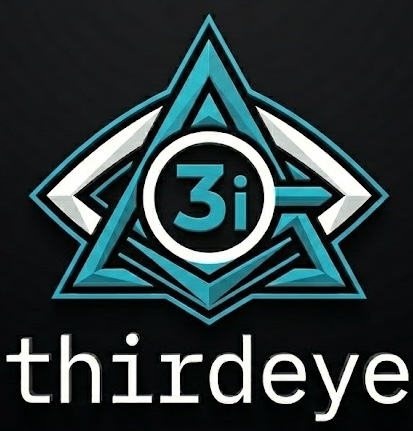

<p align="center">
  
</p>

# thirdeye

[](https://pypi.org/project/thrdi/)
[](https://github.com/duncankmckinnon/homebrew-tap)
[](https://github.com/duncankmckinnon/thirdeye/actions/workflows/test.yml)
[](https://codecov.io/gh/duncankmckinnon/thirdeye)
[](https://pypi.org/project/thrdi/)
[](LICENSE)

Trace every agent session on your machine — Claude Code, Cursor, Codex, Gemini, Copilot — into one history you and your agents can manage, search, and evaluate.

## Install

```bash
brew install duncankmckinnon/tap/thirdeye    # macOS / Linux
pipx install thrdi                           # or: uv tool install thrdi
```

## Enable tracing

```bash
thirdeye add --claude        # also: --cursor, --codex, --gemini, --copilot
```

To detach: `thirdeye remove --claude`.

## Read your history

```bash
thirdeye list                          # every session, every platform
thirdeye events <id>                   # one session, terse
thirdeye tail <id> -n 5                # last few events
thirdeye event <id> <seq>              # one event, fully expanded
thirdeye search "migration"            # substring across all sessions
thirdeye stats                         # totals
```

## Tag and filter

```bash
thirdeye tag <id> <seq> --add bug,review     # tag an event
thirdeye tag <id> --list                     # list tagged events in a session
thirdeye tag <id> <seq> --remove bug         # untag
thirdeye tags                                # global tag inventory
thirdeye search "migration" --tag review --platform claude --since 2026-05-01
```

Add `--json` for parseable JSONL, `--tree` for human-readable, `--platform` / `--cwd` / `--tag` / `--since` / `--until` to filter. Session IDs accept any unique prefix. Run `thirdeye --help` for the full reference.

## Per-turn usage

thirdeye captures model name and token counts per turn into an append-only
sidecar (`usage.jsonl`) and a global SQLite index (`usage.db`). Capture starts
automatically on the next agent run after `thirdeye add`.

```bash
thirdeye usage                          # global rollup, sessions by token spend
thirdeye usage <id>                     # per-turn detail for one session
thirdeye usage --top 5 --since 2026-05-01
thirdeye usage <id> --json              # parseable JSONL rows
thirdeye usage reindex                  # rebuild SQLite from sidecars
thirdeye usage errors                   # tail the capture audit log
```

Filters: `--platform` / `--harness`, `--model SUBSTR`, `--since` / `--until`,
`--top N`, `--sort total|input|output|ts`.

## Evaluations

Grade a recorded session by dispatching one of your installed CLI agents
(claude / codex / gemini) as an LLM-as-judge. Eval definitions are named
rubrics — directive text shipped with sensible defaults and editable per-user.

```bash
thirdeye eval def list                                          # available rubrics
thirdeye eval def show default                                  # see the directive
thirdeye eval def create my-rubric --directive "<text>"         # custom rubric

thirdeye eval run <id> --agent claude                           # foreground
thirdeye eval run <id> --agent gemini --using token-efficiency --background

thirdeye eval show <id>                                         # latest result
thirdeye eval list --since 2026-05-01 --verdict warn            # history
thirdeye eval status                                            # background jobs
```

Per-turn findings are stored with the event `seq` they anchor to, and
`thirdeye events <id>` annotates the timeline inline by default (suppress with
`--no-findings`, filter with `--eval NAME`). The eval invocation itself is a
thirdeye-traced session, so every grading run has its own audit trail.

Dispatched agents run in read-only mode (Claude `--allowedTools` allowlist,
Codex `--sandbox read-only`, Gemini `--approval-mode plan`). No new Python
deps — thirdeye shells out to the agent binaries you already have installed.

## Agent skills

Two bundled Claude-Code-format skills:

- **`use-thirdeye`** — basic CLI fluency: enable tracing, search sessions,
  debug tool calls, analyze token usage.
- **`use-thirdeye-evals`** — eval workflow: create rubrics, dispatch
  evaluators, view per-turn findings.

```bash
thirdeye skill list                                  # show bundled skill names
thirdeye skill install                               # all skills → .agents/skills/
thirdeye skill install .claude/skills                # custom parent dir
thirdeye skill install --only use-thirdeye-evals     # just one
thirdeye skill install --force                       # replace existing entries
```

Skills install as symlinks, so upgrading thirdeye (`brew upgrade thirdeye` or
`pipx upgrade thrdi`) automatically refreshes the skill content in every repo
where they're installed.

## License

MIT.
